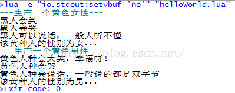

### 1.描述   

    上一篇博文讲到女娲造人,人是造出来了,世界时热闹了,可是低头一看,都是清一色的类型,缺少关爱、仇恨、喜怒哀乐等情绪,人类的生命太平淡了,女娲一想,猛然一拍脑袋,Shit!忘记给人类定义性别了,那怎么办?抹掉重来,然后就把人类重新洗牌,准备重新开始制造人类。

由于先前的工作已经花费了很大的精力做为铺垫,也不想从头开始了,那先说人类(Product 产品类)怎么改吧,好,有了,给每个人类都加一个性别,然后再重新制造,这个问题解决了,那八卦炉怎么办?只有一个呀,要么生产出全都是男性,要不都是女性,那不行呀,有了,把已经有了一条生产线——八卦炉(工厂模式中的 Concrete Factory)拆开,于是女娲就使用了“八卦拷贝术”,把原先的八卦炉一个变两个,并且略加修改,就成了女性八卦炉(只生产女性,一个具体工厂的实现类)和男性八卦炉(只生产男性,又一个具体工厂的实现类),

这个过程的类图如下:


### 2. 代码：

```lua

require "class"
 
--------IHuman -------
 
IHuman = class()
 
function IHuman:Laugh()
 
end
 
function IHuman:Cry()
 
end
 
function IHuman:Talk()
 
end
 
function IHuman:Sex()
 
end
 
--------BlackHuman -------
 
BlackHuman = class(IHuman)
 
function BlackHuman:Laugh()
	print("黑人会笑")
end
 
function BlackHuman:Cry()
	print("黑人会哭")
end
 
function BlackHuman:Talk()
	print("黑人可以说话，一般人听不懂")
end
 
function BlackHuman:Sex()
 
end
 
--------BlackMaleHuman -------
 
BlackMaleHuman = class(BlackHuman)
 
function BlackHuman:Sex()
	print("该黑种人的性别为男...")
end
 
--------BlackMaleHuman -------
 
BlackFemaleHuman = class(BlackHuman)
 
function BlackFemaleHuman:Sex()
	print("该黑种人的性别为女...")
end
 
--------WhiteHuman -------
 
WhiteHuman = class(IHuman)
 
function WhiteHuman:Laugh()
	print("白色人种会大笑，侵略的笑声")
end
 
function WhiteHuman:Cry()
	print("白色人种会哭")
end
 
function WhiteHuman:Talk()
	print("白色人种会说话，一般都是单字节")
end
 
function WhiteHuman:Sex()
 
end
 
--------WhiteMaleHuman -------
 
WhiteMaleHuman = class(BlackHuman)
 
function WhiteMaleHuman:Sex()
	print("该白种人的性别为男...")
end
 
--------WhiteFemaleHuman -------
 
WhiteFemaleHuman = class(WhiteMaleHuman)
 
function WhiteFemaleHuman:Sex()
	print("该白种人的性别为女...")
end
 
--------YellowHuman -------
 
YellowHuman = class(IHuman)
 
function YellowHuman:Laugh()
	print("黄色人种会大笑，幸福呀！")
end
 
function YellowHuman:Cry()
	print("黄色人种会哭")
end
 
function YellowHuman:Talk()
	print("黄色人种会说话，一般说的都是双字节")
end
 
function YellowHuman:Sex()
 
end
 
--------YellowMaleHuman -------
 
YellowMaleHuman = class(YellowHuman)
 
function YellowMaleHuman:Sex()
	print("该黄种人的性别为男...")
end
 
--------YellowFemaleHuman -------
 
YellowFemaleHuman = class(BlackHuman)
 
function YellowFemaleHuman:Sex()
	print("该黄种人的性别为女...")
end
 
 
--------IHumanFactory -------
 
IHumanFactory = class()
 
function IHumanFactory:CreateYellowHuman()
 
end
 
function IHumanFactory:CreateWhiteHuman()
 
end
 
function IHumanFactory:CreateBlackHuman()
 
end
 
--------MaleHumanFactory -------
 
MaleHumanFactory = class(IHumanFactory)
 
-- 创造(男)工厂类
function MaleHumanFactory:CreateYellowHuman()
	return YellowMaleHuman.new()
end
 
function MaleHumanFactory:CreateWhiteHuman()
	return WhiteMaleHuman.new()
end
 
 
function MaleHumanFactory:CreateBlackHuman()
	return BlackMaleHuman.new()
end
 
--------FemaleHumanFactory -------
 
FemaleHumanFactory = class(IHumanFactory)
 
-- 创造(女)工厂类
function FemaleHumanFactory:CreateYellowHuman()
	return YellowFemaleHuman.new()
end
 
function FemaleHumanFactory:CreateWhiteHuman()
	return WhiteFemaleHuman.new()
end
 
 
function FemaleHumanFactory:CreateBlackHuman()
	return BlackFemaleHuman.new()
end
 
-------- main -------
 
function main()
	-- 第一条生产线，男性生产线
	local maleHumanFactory = MaleHumanFactory.new()
 
	-- 第二条生产线，女性生产线
	local femaleHumanFactory = FemaleHumanFactory.new()
 
	-- 生产线建立完毕，开始生产人了
	local maleYellowHuman = maleHumanFactory:CreateYellowHuman()
	local femaleYellowHuman = femaleHumanFactory:CreateYellowHuman()
 
	print("---生产一个黄色女性---")
	femaleYellowHuman:Laugh()
	femaleYellowHuman:Cry()
	femaleYellowHuman:Talk()
	femaleYellowHuman:Sex()
 
	print("---生产一个黄色男性---")
	maleYellowHuman:Laugh()
	maleYellowHuman:Cry()
	maleYellowHuman:Talk()
	maleYellowHuman:Sex()
end
 
main()

```

运行代码，结果如下:


