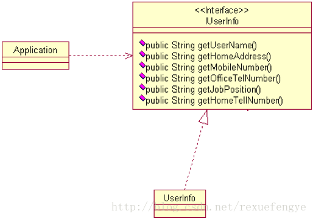
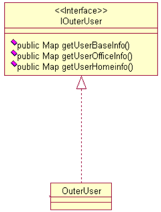
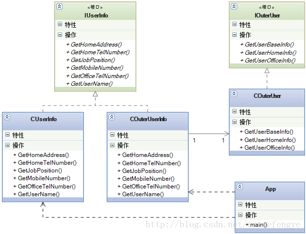

### 1.描述

“我”在 2004 年的时候带了一个项目,做一个人力资源管理,该项目是我们总公司发起的项目,公司一共有 700 多号人,包括子公司,这个项目还是比较简单的,分为三大模块:人员信息管理,薪酬管理,职位管理,其中人员管理这块就用到了适配器模式,是怎么回事呢?当时开发时明确的指明:人员信息简管理的对象是所有员工的所有信息,

然后我们就这样设计了一个类图: 



这个项目是 04 年年底投产的,运行到 05 年年底还是比较平稳的,中间修修补补也很正常,05 年年底不知道是那股风吹的,很多公司开始使用借聘人员的方式招聘人员,我们公司也不例外,从一个人力资源公司借用了一大批的低技术、低工资的人员,分配到各个子公司,总共有将近 200 号人,然后就找我们部门老大谈判,说要增加一个功能借用人员管理,老大一看有钱赚呀,一拍大腿,做!

我带人过去一调研,不是这么简单,人力资源公司有一套自己的人员管理系统,我们公司需要把我们使用到的人员信息传输到我们的系统中,系统之间的传输使用 RMI(Remote Method Invocation,远程对象调用)的方式,但是有一个问题人力资源公司的人员对象和我们系统的对象不相同呀,

他们的对象是这样的:



人员资源公司是把人的信息分为了三部分:基本信息,办公信息和个人家庭信息,并且都放到了 HashMap中,比如人员的姓名放到 BaseInfo 信息中,家庭地址放到 HomeInfo 中,这咱不好说他们系统设计的不好,那问题是咱的系统要和他们系统有交互,怎么办?使用适配器模式,

类图如下: 



### 2.代码：

```

require "class"
 
--------IUserInfo-------
IUserInfo = class()
 
function IUserInfo:GetUserName()
 
end
 
function IUserInfo:GetHomeAddress()
 
end
 
function IUserInfo:GetMobileNumber()
 
end
 
function IUserInfo:GetOfficeTelNumber()
 
end
 
function IUserInfo:GetJobPosition()
 
end
 
function IUserInfo:GetHomeTelNumber()
 
end
 
--------UserInfo-------
UserInfo = class(IUserInfo)
 
function UserInfo:GetUserName()
	print("姓名叫做...")
end
 
function UserInfo:GetHomeAddress()
	print("这里是员工的家庭地址...")
	return "0"
end
 
function UserInfo:GetMobileNumber()
	print("这个人的手机号码是0000...")
	return "0"
end
 
function UserInfo:GetOfficeTelNumber()
	print("办公室电话是...")
	return "0"
end
 
function UserInfo:GetJobPosition()
	print("这个人的职位是BOSS...")
	return "0"
end
 
function UserInfo:GetHomeTelNumber()
	print("员工的家庭电话是...")
	return "0"
end
 
--------OuterUserBaseInfo-------
OuterUserBaseInfo = class()
 
function OuterUserBaseInfo:GetUserName()
	print("姓名叫做...")
	return "0"
end
 
function OuterUserBaseInfo:GetMobileNumber()
	print("这个人的手机号码是0001...")
	return "0"
end
 
--------OuterUserOfficeInfo-------
OuterUserOfficeInfo = class()
 
function OuterUserOfficeInfo:GetOfficeTelNumber()
	print("办公室电话是...")
	return "0"
end
 
function OuterUserOfficeInfo:GetJobPosition()
	print("这个人的职位是BOSS...")
	return "0"
end
 
--------OuterUserHomeInfo-------
OuterUserHomeInfo = class()
 
function OuterUserHomeInfo:GetHomeAddress()
	print("这里是员工的家庭地址...")
	return "0"
end
 
function OuterUserHomeInfo:GetHomeTelNumber()
	print("员工的家庭电话是...")
	return "0"
end
 
--------IOuterUser-------
IOuterUser = class()
 
function IOuterUser:GetUserBaseInfo()
 
end
 
function IOuterUser:GetUserOfficeInfo()
 
end
 
function IOuterUser:GetUserHomeInfo()
 
end
 
--------OuterUser-------
OuterUser = class(IOuterUser)
 
function OuterUser:GetUserBaseInfo()
	return OuterUserBaseInfo.new()
end
 
function OuterUser:GetUserOfficeInfo()
	return OuterUserOfficeInfo.new()
end
 
function OuterUser:GetUserHomeInfo()
	return OuterUserHomeInfo.new()
end
 
 
--------OuterUserInfo-------
OuterUserInfo = class(IUserInfo)
 
function OuterUserInfo:ctor()
	self.m_pOuterUser = OuterUser.new()
end
 
function OuterUserInfo:clear()
	self.m_pOuterUser = nil
end
 
-- 获取姓名
function OuterUserInfo:GetUserName()
	local pBaseInfo = self.m_pOuterUser:GetUserBaseInfo()
	pBaseInfo:GetUserName()
	pBaseInfo = nil
 
	return "0"
end
 
-- 获取姓名
function OuterUserInfo:GetMobileNumber()
	local pBaseInfo = self.m_pOuterUser:GetUserBaseInfo()
	pBaseInfo:GetMobileNumber()
	pBaseInfo = nil
 
	return "0"
end
 
-- 获取家庭地址
function OuterUserInfo:GetHomeAddress()
	local pHomeInfo = self.m_pOuterUser:GetUserHomeInfo()
	pHomeInfo:GetHomeAddress()
	pHomeInfo = nil
 
	return "0"
end
 
-- 获取家庭电话
function OuterUserInfo:GetHomeTelNumber()
	local pHomeInfo = self.m_pOuterUser:GetUserHomeInfo()
	pHomeInfo:GetHomeTelNumber()
	pHomeInfo = nil
 
	return "0"
end
 
-- 获取办公室号码
function OuterUserInfo:GetOfficeTelNumber()
	local pOfficeInfo = self.m_pOuterUser:GetUserOfficeInfo()
	pOfficeInfo:GetOfficeTelNumber()
	pOfficeInfo = nil
 
	return "0"
end
 
-- 获取职位
function OuterUserInfo:GetJobPosition()
	local pOfficeInfo = self.m_pOuterUser:GetUserOfficeInfo()
	pOfficeInfo:GetJobPosition()
	pOfficeInfo = nil
 
	return "0"
end
 
--- main ---
function main()
	-- 本系统调用
	local pYourGirl = UserInfo.new()
	pYourGirl:GetMobileNumber()
 
	-- 外部系统调用
	pYourGirl = OuterUserInfo.new()
	pYourGirl:GetMobileNumber()
end
 
main()

```

运行结果，如下：

