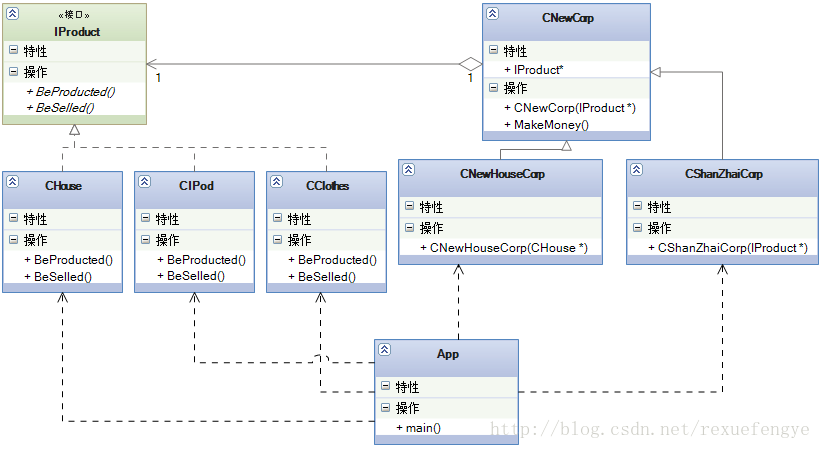
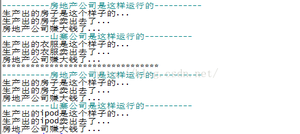

### 1.描述

今天我要说说我自己,梦想中的我自己,我身价过亿,有两个大公司,一个是房地产公司,一个是服装制造业,这两个公司都很赚钱,天天帮我在累加财富,其实是什么公司我倒是不关心,我关心的是是不是在赚钱,赚 了多少,这才是我关心的,我是商人呀,唯利是图是我的本性,偷税漏税是我的方法,欺上瞒下、压榨员工血汗 我是的手段嘛,呵呵，同时我公司也 会发展,终于在有一天我觉得赚钱速度太慢,于是我上下疏通,左右打关系,终于开辟了一条赚钱的康庄大道:生产山寨产品,什么产品呢?就是市场上什么牌子的东西火爆我生产什么牌子的东西,甭管是打火机还是电脑,只要它火爆,我就生产,赚过了高峰期就换个产品,打一枪换一个牌子,不承担售后成本、也不担心销路问题,
我只有正品的十分之一的价格,你买不买?哈哈,赚钱呀! 
      那么，我的服装厂就开始变成山寨 iPod 生产车间,然后就看我的财富在积累积累,你想呀山寨的东西不需要特别的销售渠道(正品到哪里我就到哪里),不需要维修成本(大不了给你换个,你还想咋地,过了高峰期我就改头换面了你找谁维修去,投诉?投诉谁呢?),不承担广告成本(正品在打广告,我还需要吗?需要吗?),但是我也有犯愁的时候,我这是个山寨工厂,要及时的生产出市场上流行产品,转型要快,要灵活,今天从生产 iPod 转为生产 MP4,明天再转为生产上网本,这个都需要灵活的变化,不要限制的太死,那问题来了,每次我的厂房,我的工人,我的设备都在,不可能每次我换个山寨产品我的厂子就彻底不要了,这不行,成本忒高了点,那怎么办?

请看类图：



CNewCorp 类和 IProduct 类建立一个关联关系,可以彻底解决我以后山寨公司生产产品的问题了。

注释：

    main()，客户
    
    IProduct，产品接口
    
    CHouse，房子
    
    CIPod，ipod
    
    CClothes，服装
    
    CNewCorp，桥梁类，MakeMoney()是桥梁方法
    
    CNewHouseCorp，只能生产房子，所以构造函数是CHouse*
    
    CShanZhaiCorp，什么赚钱就生产什么，所以构造函数是IProduct*

说明：

    客户直接使用CNewHouseCorp和CShanZhaiCorp类，在main()函数里构造产品，然后传到这两个类里。这两个类的MakeMoney()函数，先调用基类的MakeMoney()，然后分别执行各自的逻辑。

注意：

    CNewCorp起到了桥梁的作用。可以分别增加产品和公司。

### 2.代码

```

require "class"
 
-----------IProduct------------
IProduct = class()
 
function IProduct:BeProducted()
 
end
 
function IProduct:BeSelled()
 
end
-- 注:其实不需要继承IProduct
-----------House------------
House = class(IProduct)
 
function House:BeProducted()
	print("生产出的房子是这个样子的...")
end
 
function House:BeSelled()
	print("生产出的房子卖出去了...")
end
 
-----------Clothes------------
Clothes = class(IProduct)
 
function Clothes:BeProducted()
	print("生产出的衣服是这个样子的...")
end
 
function Clothes:BeSelled()
	print("生产出的衣服卖出去了...")
end
 
 
-----------IPod------------
IPod = class(IProduct)
 
function IPod:BeProducted()
	print("生产出的ipod是这个样子的...")
end
 
function IPod:BeSelled()
	print("生产出的ipod卖出去了...")
end
 
-- 桥梁--
-------------NewCorp--------------
NewCorp = class()
 
function NewCorp:ctor(pproduct)
	self.m_pProduct = pproduct
end
 
function NewCorp:IMakeMoney()
	-- 每个公司都是一样，先生产
	self.m_pProduct:BeProducted()
 
	-- 然后销售
	self.m_pProduct:BeSelled()
end
 
-------------NewHouseCorp--------------
NewHouseCorp = class(NewCorp)
 
function NewHouseCorp:MakeMoney()
	self:IMakeMoney()
 
	print("房地产公司赚大钱了...")
end
 
-------------ShanZhaiCorp--------------
ShanZhaiCorp = class(NewCorp)
 
function ShanZhaiCorp:MakeMoney()
	self:IMakeMoney()
	print("房地产公司赚大钱了...")
end
 
-------------DoNewRun Test--------------
function DoNewRun1()
	print("----------房地产公司是这样运行的----------")
	local house = House.new()
	local newHouseCorp = NewHouseCorp.new(house)
	newHouseCorp:MakeMoney()
 
	print("----------山寨公司是这样运行的----------")
	local clothes = Clothes.new()
	local shanZhaiCorp = ShanZhaiCorp.new(clothes)
	shanZhaiCorp:MakeMoney()
end
 
function DoNewRun2()
	print("----------房地产公司是这样运行的----------")
	local house = House.new()
	local newHouseCorp = NewHouseCorp.new(house)
	newHouseCorp:MakeMoney()
 
	print("----------山寨公司是这样运行的----------")
	local ipod = IPod.new()
	local shanZhaiCorp = ShanZhaiCorp.new(ipod)
	shanZhaiCorp:MakeMoney()
 
end
 
--- main ---
function main()
	DoNewRun1()
	print("*********************************")
	DoNewRun2()
end
 
main()

```

运行结果，如下：

