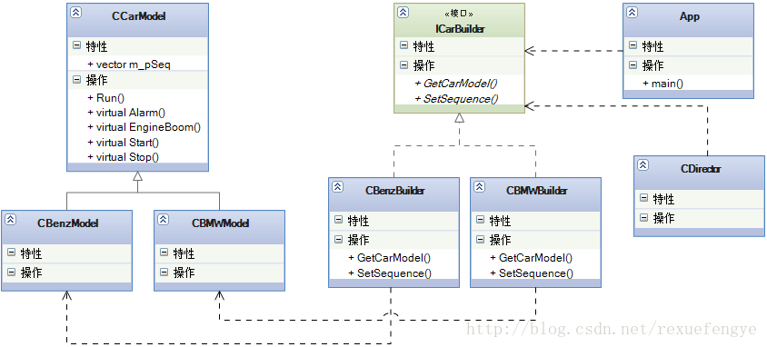
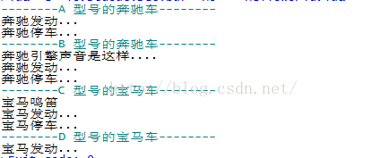

### 1.描述：

又是一个周三,快要下班了,老大突然又拉住我,喜滋滋的告诉我“牛叉公司很满意我们做的模型,又签订了一个合同,把奔驰、宝马的车辆模型都交给我我们公司制作了,不过这次又额外增加了一个新需求:汽车的启动、停止、喇叭声音、引擎声音都有客户自己控制,他想什么顺序就什么顺序,这个没问题吧?”。
    看着老大殷切的目光,我还能说啥,肯定的点头,“没问题!”,加班加点做呗,“再苦再累就当自己二百五 再难再险就当自己二皮脸 与君共勉!”这句话说出了我的心声。那任务是接下来,我们怎么做实现呢?首先我们想了,奔驰、宝马都是一个产品,他们有共有的属性,牛叉公司关心的是单个模型,奔驰模型 A 是先有引擎声音,然后再启动;奔驰模型 B 呢是先启动起来,然后再有引擎声音,这才是牛叉公司要关关心的,那到我们老大这边呢,就是满足人家的要求,要什么顺序就立马能产生什么顺序的模型出来,我呢就负责把老大的要求实现掉,而且还要是批量的,看不懂?没关系,继续看下去,首先由我生产出 N多个奔驰和宝马车辆模型,这些车辆模型的都有 run 方法,但是具体到每一个模型的 run 方法可能中间的执行任务的顺序是不同的,老大说要啥顺序,我就给啥顺序,最终客户买走后只能是既定的模型。

先看类图: 



    注释：

        main()，客户

        CCarModel，产品模型

        CBenzModel，奔驰模型

        CBMWModel，宝马模型

        ICarBuilder，建造者接口

        CBenzBuilder，奔驰建造者

        CBMWBuilder，宝马建造者

        CDirector，导演

    说明：

        CCarModel实现模板方法，Builder负责开始建造产品。建造产品时，构建的顺序由Director或main决定。

    注意：

        建造者模式和抽象工厂非常类似。建造者更重视产品建造时的逻辑顺序，而抽象工厂更重视生产出不同型号的产品，抽象工厂不关心顺序。

### 2.代码：

```lua

require "class"
-------- CarModel --------
CarModel = class()
function CarModel:ctor()
	self.m_pSequence = {}
end
 
function CarModel:Start()
	print("CarModel Start")
end
 
function CarModel:Stop()
	print("CarModel Stop")
end
 
function CarModel:Alarm()
	print("CarModel Alarm")
end
 
function CarModel:EngineBoom()
	print("CarModel EngineBoom")
end
 
function CarModel:SetSequence(pSeq)
	self.m_pSequence = pSeq
end
 
function CarModel:Run()
	if self.m_pSequence then
		for _,v in pairs(self.m_pSequence) do
			if v == "start" then
				self:Start()
			elseif v == "stop" then
				self:Stop()
			elseif v == "alarm" then
				self:Alarm()
			elseif v == "engineBoom" then
				self:EngineBoom()
			end
		end
	end
end
 
-------- BenzModel --------
BenzModel = class(CarModel)
 
function BenzModel:Start()
	print("奔驰发动...")
end
 
function BenzModel:Stop()
	print("奔驰停车...")
end
 
function BenzModel:Alarm()
	print("奔驰鸣笛")
end
 
function BenzModel:EngineBoom()
	print("奔驰引擎声音是这样....")
end
 
-------- BMWModel --------
BMWModel = class(CarModel)
 
function BMWModel:Start()
	print("宝马发动...")
end
 
function BMWModel:Stop()
	print("宝马停车...")
end
 
function BMWModel:Alarm()
	print("宝马鸣笛")
end
 
function BMWModel:EngineBoom()
	print("宝马引擎声音是这样....")
end
 
-----------------------------
-------- ICarBuilder --------
-----------------------------
ICarBuilder = class()
 
function ICarBuilder:SetSequence(pseq)
 
end
 
function ICarBuilder:GetCarModel()
 
end
 
-------- BenzBuilder --------
BenzBuilder = class(ICarBuilder)
 
function BenzBuilder:ctor()
	self.m_pBenz = BenzModel.new()
end
 
function BenzBuilder:clear()
	print("BenzBuilder:clear")
	self.m_pBenz = nil
end
 
function BenzBuilder:SetSequence(pSeq)
	self.m_pBenz:SetSequence(pSeq)
end
 
function BenzBuilder:GetCarModel()
	return self.m_pBenz
end
 
-------- BMWBuilder --------
BMWBuilder = class(ICarBuilder)
 
function BMWBuilder:ctor()
	--print("BenzBuilder:ctor")
	self.m_pBMW = BMWModel.new()
end
 
function BMWBuilder:clear()
	self.m_pBMW = nil
end
 
function BMWBuilder:SetSequence(pSeq)
	self.m_pBMW:SetSequence(pSeq)
end
 
function BMWBuilder:GetCarModel()
	return self.m_pBMW
end
 
--[[
A 型号的奔驰车辆模型是只有启动(start)、停止(stop)方法,其他的引擎声音、喇叭都没有;
B 型号的奔驰车是先发动引擎(engine boom),然后启动(star),再然后停车(stop),没有喇叭;
C 型号的宝马车是先喇叭叫一下(alarm),然后(start),再然后是停车(stop),引擎不轰鸣;
D 型号的宝马车就一个启动(start),然后一路跑到黑,永动机,没有停止方法,没有喇叭,没有引擎轰鸣;E 型号、F 型号...等等,可以有很多,启动(start)、停止(stop)、喇叭(alarm)、引擎轰鸣(engine boom)
]]
--------------------------
-------- Director --------
--------------------------
Director = class()
 
function Director:ctor()
	self.m_pSeqence 	= {}
	self.m_pBenzBuilder = BenzBuilder.new()
	self.m_pBMWBuilder 	= BMWBuilder.new()
end
 
function Director:clear()
	self.m_pSeqence 	= {}
	self.m_pBenzBuilder = nil
	self.m_pBMWBuilder 	= nil
end
 
-- A 型号的奔驰车
function Director:GetABenzModel()
	print("--------A 型号的奔驰车--------")
 
	self.m_pSeqence = {}
 
	table.insert(self.m_pSeqence, "start")
	table.insert(self.m_pSeqence, "stop")
 
	self.m_pBenzBuilder:SetSequence(self.m_pSeqence)
 
	return self.m_pBenzBuilder:GetCarModel()
end
 
-- B 型号的奔驰车
function Director:GetBBenzModel()
	print("--------B 型号的奔驰车--------")
 
	self.m_pSeqence = {}
 
	table.insert(self.m_pSeqence, "engineBoom")
	table.insert(self.m_pSeqence, "start")
	table.insert(self.m_pSeqence, "stop")
 
	self.m_pBenzBuilder:SetSequence(self.m_pSeqence)
 
	return self.m_pBenzBuilder:GetCarModel()
end
 
-- C 型号的宝马车
function Director:GetCBMWModel()
	print("--------C 型号的宝马车--------")
 
	self.m_pSeqence = {}
 
	table.insert(self.m_pSeqence, "alarm")
	table.insert(self.m_pSeqence, "start")
	table.insert(self.m_pSeqence, "stop")
	self.m_pBMWBuilder:SetSequence(self.m_pSeqence)
 
	return self.m_pBMWBuilder:GetCarModel()
end
 
 
-- D 型号的宝马车
function Director:GetDBMWModel()
	print("--------D 型号的宝马车--------")
 
	self.m_pSeqence = {}
 
	table.insert(self.m_pSeqence, "start")
	self.m_pBMWBuilder:SetSequence(self.m_pSeqence)
 
	return self.m_pBMWBuilder:GetCarModel()
end
 
--- main ---
function main()
	director = Director.new()
	director:GetABenzModel():Run()
	director:GetBBenzModel():Run()
	director:GetCBMWModel():Run()
	director:GetDBMWModel():Run()
end
 
main()

```

运行结果如下：

