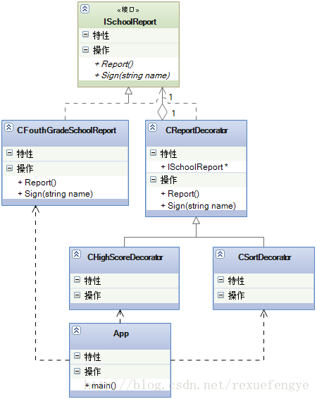
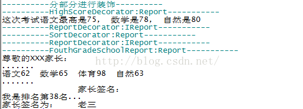

### 1.描述

就说说"我"上小学的的糗事吧。我上小学的时候学习成绩非常的差,班级上 40 多个同学,我基本上都是在排名 45 名以后,按照老师给我的定义就是“不是读书的料”,但是我老爸管的很严格,明知道我不是这块料,还是往赶鸭子上架,每次考试完毕我都是战战兢兢的,“竹笋炒肉”是肯定少不了的,能少点就少点吧,肉可是自己的呀。四年级期末考试考完,学校出来个很损的招儿(这招儿现在很流行的),打印出成绩单,要家长签字,然后才能上五年级,我那个恐惧呀,不过也就是几秒钟的时间,玩起来什么都忘记了。当时，我的成绩（语文 62 数学65 体育 98 自然 63），你要知道在小学低于 90 分基本上就是中下等了,唉，爱学习的人太多了!怎么着,那我把这个成绩单给老爸看看?

就这成绩还要我签字?!老爸就开始找笤帚,我的屁股已经做好了准备,肌肉要绷紧,要不那个太疼了!哈哈,幸运的是,这个不是当时的真实情况,我没有直接把成绩单交给老爸,而是在交给他之前做了点技术工作,我要把成绩单封装一下,封装分类两步走:

第一步:跟老爸说各个科目的最高分,语文最高是 75,数学是 78,自然是 80,然老爸觉的我成绩与最高分数相差不多,这个是实情,但是不知道是什么原因,反正期末考试都考的不怎么样,但是基本上都集中在 70 分以上,我这 60 多分基本上还是垫底的角色;

第二步:在老爸看成绩单后,告诉他我是排名第 38 名,全班,这个也是实情,为啥呢?有将近十个同学退学了!这个情况我是不说的。不知道是不是当时第一次发成绩单,学校没有考虑清楚,没有写上总共有多少同学,排名第几名等等,反正是被我钻了个空子。

类图如下：



### 2.代码

```lua

require "class"
 
--------ISchoolReport-------
ISchoolReport = class()
 
function ISchoolReport:Report()
 
end
 
function ISchoolReport:Sign(name)
 
end
 
--------FouthGradeSchoolReport-------
FouthGradeSchoolReport = class(ISchoolReport)
 
function FouthGradeSchoolReport:Report()
	print("----------FouthGradeSchoolReport:Report-----------")
	print("尊敬的XXX家长：")
	print(".......")
	print("语文62  数学65  体育98  自然63")
	print(".......")
	print("                家长签名：")
end
 
function FouthGradeSchoolReport:Sign(name)
	print("家长签名为：", name)
end
 
--------ReportDecorator-------
ReportDecorator = class(ISchoolReport)
 
function ReportDecorator:ctor(psr)
	self.m_pSchoolReport = psr
end
 
function ReportDecorator:IReport()
	print("----------ReportDecorator:IReport-----------")
	self.m_pSchoolReport:Report()
end
 
function ReportDecorator:Sign(name)
	self.m_pSchoolReport:Sign(name)
end
 
--------HighScoreDecorator-------
HighScoreDecorator = class(ReportDecorator)
 
function HighScoreDecorator:Report()
	print("----------HighScoreDecorator:Report-----------")
	self:ReportHighScore()
	self:IReport()
end
 
function HighScoreDecorator:ReportHighScore()
	print("这次考试语文最高是75， 数学是78， 自然是80")
end
 
--------SortDecorator-------
SortDecorator = class(ReportDecorator)
 
function SortDecorator:ReportSort()
	print("我是排名第38名...")
end
 
function SortDecorator:Report()
	print("----------SortDecorator:Report-----------")
	self:IReport()
	self:ReportSort()
end
 
--------test-------
function DoIt()
	local psr = FouthGradeSchoolReport.new()
	psr:Report()
	psr:Sign("老三")
end
 
function DoNew()
	print("----------分部分进行装饰----------")
	local psr = FouthGradeSchoolReport.new()   -- 原装成绩单
	local pssr = SortDecorator.new(psr) 		-- 又加了成绩排名的说明
	local phsr = HighScoreDecorator.new(pssr)  -- 加了最高分说明的成绩单
 
	phsr:Report()
	phsr:Sign("老三")
end
 
--- main ---
function main()
	--DoIt()
	DoNew()
end
 
main()

```

运行结果：

