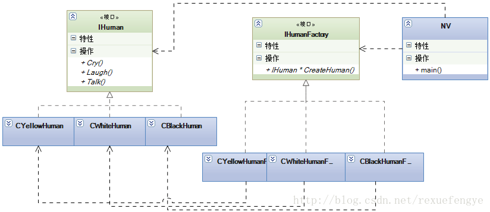
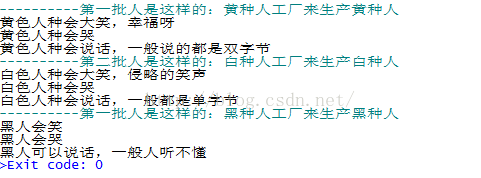

### 1.描述

女娲补天的故事大家都听说过吧,今天不说这个,说女娲创造人的故事,可不是“造人”的工作,这个词被现代人滥用了。这个故事是说,女娲在补了天后,下到凡间一看,哇塞,风景太优美了,天空是湛蓝的,水是清澈的,空气是清新的,太美丽了,然后就待时间长了就有点寂寞了,没有动物,这些看的到都是静态的东西呀,怎么办?别忘了是神仙呀,没有办不到的事情,于是女娲就架起了八卦炉(技术术语:建立工厂)开始创建人,具体过程是这样的:先是泥巴捏,然后放八卦炉里烤,再扔到地上成长,但是意外总是会产生的:第一次烤泥人,兹兹兹兹~~,感觉应该熟了,往地上一扔,biu~,一个白人诞生了,没烤熟!第二次烤泥人,兹兹兹兹兹兹兹兹~~,上次都没烤熟,这次多烤会儿,往地上一扔,嘿,熟过头了,黑人哪!第三次烤泥人,兹~兹~兹~,一边烤一边看着,嘿,正正好,Perfect!优品,黄色人类!这个过程还是比较有意思的,

先看看类图: 



```lua

-- 加载文件
require "class"
 
------------------------------
-- 产品
------------------------------
-- 人类
IHuman = class()
 
function IHuman:Laugh()
	print("IHuman Laugh")
end
 
function IHuman:Cry()
	print("IHuman Cry")
end
 
function IHuman:Talk()
	print("IHuman Talk")
end
 
-- 黄种人
YellowHuman = class(IHuman)
 
function YellowHuman:Laugh()
	print("黄色人种会哭")
end
 
function YellowHuman:Cry()
	print("黄色人种会大笑，幸福呀")
end
 
function YellowHuman:Talk()
	print("黄色人种会说话，一般说的都是双字节")
end
 
-- 白种人
WhiteHuman = class(IHuman)
 
function WhiteHuman:Laugh()
	print("白色人种会哭")
end
 
function WhiteHuman:Cry()
	print("白色人种会大笑，侵略的笑声")
end
 
function WhiteHuman:Talk()
	print("白色人种会说话，一般都是单字节")
end
 
-- 黑种人
BlackHuman = class(IHuman)
 
function BlackHuman:Laugh()
	print("黑人会哭")
end
 
function BlackHuman:Cry()
	print("黑人会笑")
end
 
function BlackHuman:Talk()
	print("黑人可以说话，一般人听不懂")
end
 
---------------
-- 工厂
---------------
IHumanFactory = class()
function IHumanFactory:CreateHuman()
	print("IHumanFactory")
end
 
-- 创造黄种人工厂类
YellowHumanFactory = class(IHumanFactory)
function YellowHumanFactory:CreateHuman()
	return YellowHuman:new()
end
 
-- 创造白种人工厂类
WhiteHumanFactory = class(IHumanFactory)
function WhiteHumanFactory:CreateHuman()
	return WhiteHuman:new()
end
 
-- 创造黑种人工厂类
BlackHumanFactory = class(IHumanFactory)
function BlackHumanFactory:CreateHuman()
	return BlackHuman:new()
end
 
-- 测试代码
function DoFactoryMethod(factory)
	if factory == nil then return end
	IHuman = factory:CreateHuman()
	IHuman:Cry()
	IHuman:Laugh()
	IHuman:Talk()
end
 
--- main ---
function main()
	print("----------第一批人是这样的：黄种人工厂来生产黄种人")
	DoFactoryMethod(YellowHumanFactory:new())
	print("----------第二批人是这样的：白种人工厂来生产白种人")
	DoFactoryMethod(WhiteHumanFactory:new())
	print("----------第一批人是这样的：黑种人工厂来生产黑种人")
	DoFactoryMethod(BlackHumanFactory:new())
end
 
main()

```

运行结果如下 ：



注释：

class.lua

```lua

local _class={}
 
function class(super)
	local class_type={}
	class_type.ctor=false
	class_type.super=super
	class_type.new=function(...)
			local obj={}
			do
				local create
				create = function(c,...)
					if c.super then
						create(c.super,...)
					end
					if c.ctor then
						c.ctor(obj,...)
					end
				end
 
				create(class_type,...)
			end
			setmetatable(obj,{ __index=_class[class_type] })
			return obj
		end
	local vtbl={}
	_class[class_type]=vtbl
 
	setmetatable(class_type,{__newindex=
		function(t,k,v)
			vtbl[k]=v
		end
	})
 
	if super then
		setmetatable(vtbl,{__index=
			function(t,k)
				local ret=_class[super][k]
				vtbl[k]=ret
				return ret
			end
		})
	end
 
	return class_type
end

```