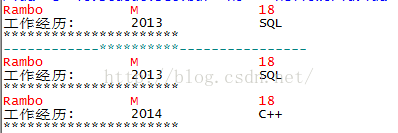

### 1.描述

首先从实际生活来了解原型模式的由来，假设你有一份非常好的讲义，你的朋友也想要一份，那么怎么办？重新手抄一份？显然不是，当然是用复印机复印一份来得方便、直接，并且准确性也高，这种用原型来复制而不是重新创建的思维方式就是原型模式的核心思想。

Prototype Pattern也是一种创建型模式，它关注的是大量相同或相似对象的创建问题。应用原型模式就是建立一个原型，然后通过对原型来进行复制的方法，来产生一个和原型相同或相似的新对象，或者说用原型实例指定创建对象的种类，并且通过复制这些原型创建新的对象,比如简历。

### 2.代码

```lua

function table.deepcopy(object)
    local lookup_table = {}
 
    local function _copy(object)
        if type(object) ~= "table" then
            return object
        elseif lookup_table[object] then
            return lookup_table[object]
        end
 
        local new_table = {}
        lookup_table[object] = new_table
 
        for index, value in pairs(object) do
            new_table[_copy(index)] = _copy(value)
        end
 
        return setmetatable(new_table, getmetatable(object))
    end
 
    return _copy(object)
end
 
--------Experience-------
Experience = class()
 
function Experience:ctor()
	self.timeArea = nil
	self.company = nil
end
 
function Experience:WorkExperience(timeArea, company)
	self.timeArea = timeArea
	self.company = company
end
 
--------Resume-------
Resume = class()
 
function Resume:ctor(name)
	self.name = name
	self.sex  = nil
	self.age  = nil
	self.WorkExperience = Experience.new()
end
 
function Resume:SetPersonalInfo(sex, age)
	self.sex = sex
	self.age = age
end
 
function Resume:SetWorkExperience(timeArea, company)
	self.WorkExperience:WorkExperience(timeArea, company)
end
 
function Resume:Display()
	print(self.name, " ", self.sex, " ", self.age)
	print("工作经历:",self.WorkExperience.timeArea, "  ", self.WorkExperience.company)
	print("**********************")
end
 
function Resume:Clone()
	return table.deepcopy(self)
end
 
--- main ---
function main()
	A = Resume.new("Rambo")
	A:SetPersonalInfo("M", "18")
	A:SetWorkExperience("2013", "SQL")
	A:Display();
 
	B = A:Clone()
	B:SetWorkExperience("2014","C++");
	print("------------**********----------------")
	A:Display();
	B:Display()
end
 
main()

```

运行结果,如下：

