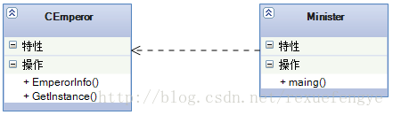
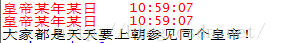

### 1.描述：


 这个模式是很有意思,而且比较简单,但是我还是要说因为它使用的是如此的广泛,如此的有人缘,单例就是单一、独苗的意思,那什么是独一份呢?你的思维是独一份,除此之外还有什么不能山寨的呢?我们举个比较难复制的对象:皇帝。
    中国的历史上很少出现两个皇帝并存的时期,是有,但不多,那我们就认为皇帝是个单例模式,在这个场景中,有皇帝,有大臣,大臣是天天要上朝参见皇帝的,今天参拜的皇帝应该和昨天、前天的一样(过渡期的不考虑,别找茬哦),大臣磕完头,抬头一看,嗨,还是昨天那个皇帝,单例模式,绝对的单例模式,

先看类图: 



注释：

    main()，大臣

    CEmperor，需要单例的类

    说明：很多大臣拜见的皇帝，只有一个。体现在面向对象方面，CEmperor定义一个静态指针，和一个静态函数，私有化构造函数、析构函数、构造函数复制、重载赋值语句。

    注意：线程安全，采用互斥体的方式实现。


### 2. 代码：

```lua

Emperor = {}
function Emperor:new(o)
    o = o or {}
    setmetatable(o,self)
    self.__index = self
    return o
end
 
function Emperor:GetInstance()
    if self.m_pEmperor == nil then
        self.m_pEmperor = self:new()
    end
 
    return self.m_pEmperor
end
 
function Emperor:ReleaseInstance()
	if self.m_pEmperor then
		self.m_pEmperor = nil
	end
end
 
function Emperor:EmperorInfo()
	print("皇帝某年某日", os.date("%X", os.time()))
end
 
--- main ---
function main()
	pEmperor1 = Emperor:GetInstance()
	pEmperor1:EmperorInfo()
 
	pEmperor2 = Emperor:GetInstance()
	pEmperor2:EmperorInfo()
 
	if pEmperor1 == pEmperor2 then
		print("大家都是天天要上朝参见同个皇帝！")
	end
end
 
main()

```

运行结果，如下：

